# Vintiz POS — Codes-barres de test

Série de 15 produits de test prêts pour le premier passage caisse avec
le matériel reçu : **iPad + douchette Inateck 160B + imprimante ticket
80 mm + tiroir RJ11 + TPE SumUp Solo**.

## Préparation (une fois)

1. **Backend SumUp** — dans `.env` :

   ```env
   SUMUP_ENVIRONMENT=sandbox
   SUMUP_API_KEY=              # vide = sandbox simulé auto
   SUMUP_MERCHANT_CODE=
   SUMUP_SANDBOX_AUTO_DELAY_SEC=5   # 0 = approbation manuelle
   ```

   - **Sans clé** : sandbox simulé en mémoire, événements visibles dans
     *Paramètres > Paiement*, approve/decline manuel disponible.
   - **Avec clé** : appels réels vers l'API SumUp sandbox.

2. **Seed** — créer/réassigner les 15 produits et régénérer ce doc :

   ```bash
   PYTHONPATH=apps/api python scripts/seed_test_products.py
   # ou juste régénérer images + markdown sans DB :
   python scripts/seed_test_products.py --docs-only
   ```

3. **Douchette Inateck 160B** — branchement USB, mode HID clavier par
   défaut (aucune config). Elle tape le code lu puis envoie Entrée.
   Vérifier dans le manuel que le suffixe *CR/Enter* est bien activé.

4. **Imprimante + tiroir** — l'imprimante thermique 80 mm se connecte à
   l'iPad en AirPrint (Wi-Fi). Le tiroir-caisse se branche sur le port
   **RJ11** (ou DK) de l'imprimante. Dans le driver imprimante, activer
   "open cash drawer on print".

5. **Caisse** — ouvrir la caisse via */pos* → bouton **Ouvrir la caisse**
   (saisir le fond), puis effectuer les ventes.

## Procédure de test

- **Scan** : poser la douchette sur un code-barres ci-dessous → le
  produit s'ajoute au panier (champ recherche auto-focus).
- **Encaisser** : bouton Encaisser → choisir moyen de paiement :
  - *Espèces* → numpad tactile + monnaie à rendre.
  - *Carte (CB)* → le TPE SumUp Solo demande la carte (en sandbox :
    auto-validation après 5 s, ou approve/decline manuel dans Settings).
  - *Chèque* → saisie manuelle.
- **Ticket** : à validation, le ticket s'affiche. Cliquer **Imprimer**
  → impression papier + ouverture automatique du tiroir-caisse.
- **Z report** : en fin de journée, bouton **Fermer la caisse** →
  saisie fond final → rapport Z généré.

> Tous les codes sont **Code 128**, lisibles par n'importe quelle
> douchette USB HID dont l'Inateck 160B.

---

## Les 15 produits de test

### 1. Sac boutique Vintiz

- **Code-barres** : `TEST0001`
- **Marque** : Vintiz
- **Couleur** : Kraft
- **Taille** : —
- **Genre** : femme
- **Catégorie** : Accessoire
- **Prix TTC** : **0.25 €**

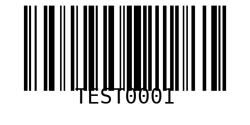

---

### 2. T-shirt coton Uniqlo

- **Code-barres** : `TEST0002`
- **Marque** : Uniqlo
- **Couleur** : Blanc
- **Taille** : taille M
- **Genre** : femme
- **Catégorie** : Haut
- **Prix TTC** : **9.00 €**


---

### 3. Jean slim Zara

- **Code-barres** : `TEST0003`
- **Marque** : Zara
- **Couleur** : Bleu
- **Taille** : taille 38
- **Genre** : femme
- **Catégorie** : Pantalon
- **Prix TTC** : **19.00 €**

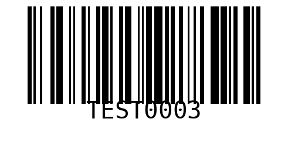

---

### 4. Robe fleurie Sandro

- **Code-barres** : `TEST0004`
- **Marque** : Sandro
- **Couleur** : Rose
- **Taille** : taille S
- **Genre** : femme
- **Catégorie** : Robe
- **Prix TTC** : **49.00 €**

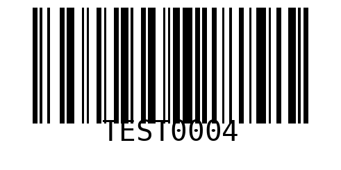

---

### 5. Blouse soie Maje

- **Code-barres** : `TEST0005`
- **Marque** : Maje
- **Couleur** : Ivoire
- **Taille** : taille 36
- **Genre** : femme
- **Catégorie** : Haut
- **Prix TTC** : **39.00 €**


---

### 6. Veste en jean Levi's

- **Code-barres** : `TEST0006`
- **Marque** : Levi's
- **Couleur** : Bleu
- **Taille** : taille M
- **Genre** : femme
- **Catégorie** : Manteau
- **Prix TTC** : **29.00 €**

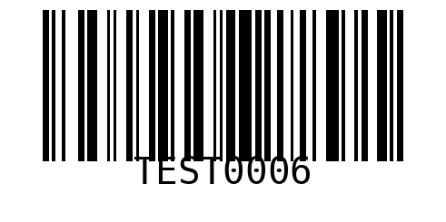

---

### 7. Pull cachemire A.P.C.

- **Code-barres** : `TEST0007`
- **Marque** : A.P.C.
- **Couleur** : Camel
- **Taille** : taille S
- **Genre** : femme
- **Catégorie** : Haut
- **Prix TTC** : **59.00 €**

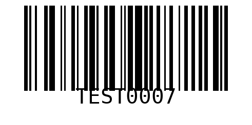

---

### 8. Chemise lin Cos

- **Code-barres** : `TEST0008`
- **Marque** : Cos
- **Couleur** : Blanc
- **Taille** : taille L
- **Genre** : homme
- **Catégorie** : Haut
- **Prix TTC** : **19.00 €**

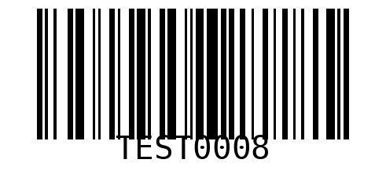

---

### 9. Pantalon chino Massimo Dutti

- **Code-barres** : `TEST0009`
- **Marque** : Massimo Dutti
- **Couleur** : Beige
- **Taille** : taille 46
- **Genre** : homme
- **Catégorie** : Pantalon
- **Prix TTC** : **25.00 €**


---

### 10. Manteau laine Ralph Lauren

- **Code-barres** : `TEST0010`
- **Marque** : Ralph Lauren
- **Couleur** : Marine
- **Taille** : taille L
- **Genre** : homme
- **Catégorie** : Manteau
- **Prix TTC** : **79.00 €**

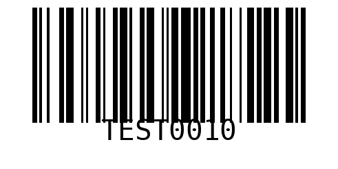

---

### 11. Sweat Petit Bateau 6 ans

- **Code-barres** : `TEST0011`
- **Marque** : Petit Bateau
- **Couleur** : Rose
- **Taille** : taille 6 ans
- **Genre** : enfant
- **Catégorie** : Haut
- **Prix TTC** : **9.00 €**

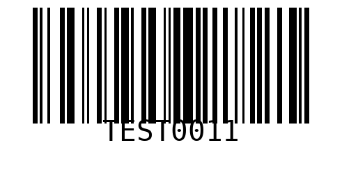

---

### 12. Robe Jacadi 4 ans

- **Code-barres** : `TEST0012`
- **Marque** : Jacadi
- **Couleur** : Bleu
- **Taille** : taille 4 ans
- **Genre** : enfant
- **Catégorie** : Robe
- **Prix TTC** : **15.00 €**

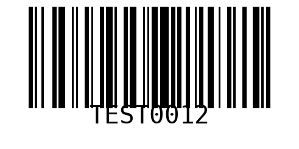

---

### 13. Baskets enfant Bonpoint

- **Code-barres** : `TEST0013`
- **Marque** : Bonpoint
- **Couleur** : Blanc
- **Taille** : taille 28
- **Genre** : enfant
- **Catégorie** : Chaussures
- **Prix TTC** : **19.00 €**

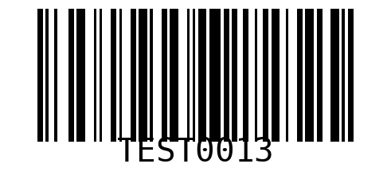

---

### 14. Foulard soie Hermès

- **Code-barres** : `TEST0014`
- **Marque** : Hermès
- **Couleur** : Multi
- **Taille** : —
- **Genre** : femme
- **Catégorie** : Accessoire
- **Prix TTC** : **79.00 €**

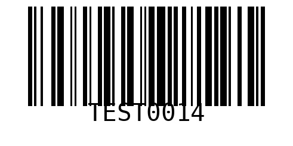

---

### 15. Ceinture cuir The Kooples

- **Code-barres** : `TEST0015`
- **Marque** : The Kooples
- **Couleur** : Noir
- **Taille** : taille 90
- **Genre** : homme
- **Catégorie** : Accessoire
- **Prix TTC** : **15.00 €**

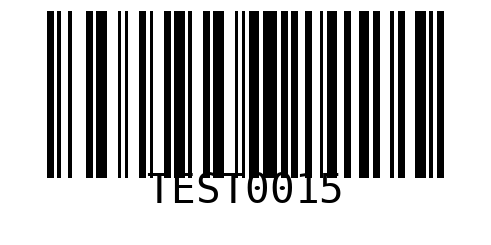

---

## Scénarios de test suggérés

| # | Scénario | Articles | Paiement attendu |
|---|----------|----------|------------------|
| 1 | Vente simple espèces | TEST0002 | 9,00 € espèces + rendu monnaie |
| 2 | Vente CB sandbox | TEST0004 + TEST0005 | 88,00 € carte via SumUp Solo |
| 3 | Panier mixte + sac | TEST0003 + TEST0001 | 19,25 € au choix |
| 4 | Remise -20 % | TEST0010 avec remise 20 % | 63,20 € CB |
| 5 | Article manuel | Saisie libre "retouche" 5 € | 5,00 € espèces |
| 6 | Fidélité | Client existant + TEST0007 | CB avec points |
| 7 | Ouverture / fermeture caisse | — | Fond initial + Z report |
| 8 | Approve/decline manuel CB | TEST0006 + CB | Valider dans Settings > Paiement |

## Dépannage

- **La douchette ne scanne rien** : vérifier que le champ recherche est
  focalisé (il l'est par défaut à l'ouverture de `/pos`) ; l'Inateck 160B
  envoie les caractères + *Enter* suffixé — vérifier la config du
  suffixe dans son manuel si le scan ne déclenche pas l'ajout panier.
- **Le produit n'est pas trouvé** : relancer le seed sans `--docs-only` ;
  vérifier que l'API tourne sur `NEXT_PUBLIC_API_URL`.
- **Le ticket ne s'imprime pas** : autoriser les pop-ups pour le domaine
  (Safari → Réglages → Sites web → Fenêtres pop-up → Autoriser).
- **Le tiroir ne s'ouvre pas** : configurer "open drawer on print" dans
  le driver de l'imprimante ; sans cette option il faudra un kick ESC/POS.
- **Le TPE ne réagit pas** : sans `SUMUP_API_KEY`, le mode est sandbox
  simulé — le checkout auto-valide après `SUMUP_SANDBOX_AUTO_DELAY_SEC`
  secondes. Réglable sur 0 pour forcer l'approbation manuelle.
- **Le paiement CB reste PENDING** : aller dans *Paramètres > Paiement*
  → event log → cliquer *Approuver* ou *Refuser* sur le checkout en cours.
